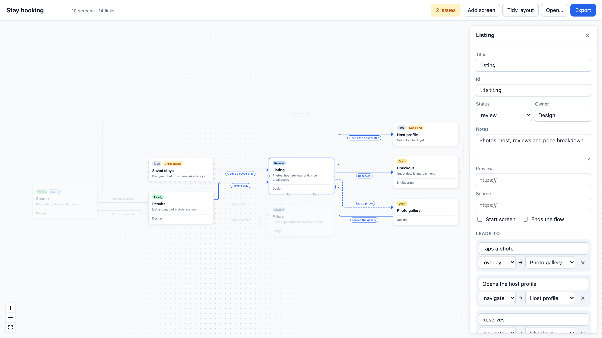

# Prototype graph

See how the screens of a multi-screen prototype connect. Describe the flow once in a JSON file and get an interactive map: every screen, every way between them, and the places where the flow is broken.

<picture>
  <source media="(prefers-color-scheme: dark)" srcset="docs/screenshot-dark.png">
  
</picture>

## Why

Once a prototype grows past a handful of screens, nobody holds the whole flow in their head. Designers see pages, engineers see routes, reviewers click around and miss the screen that nothing links to. A map of the flow answers the questions a click-through can't: where does this screen lead, what reaches it, and which paths go nowhere.

## What it does

- Lays the flow out left to right in the order a person moves through it, with links routed around the cards and labelled with what triggers them.
- Draws the kind of each link: solid for navigation, dashed for overlays (sheets, modals), dotted for redirects.
- Finds problems: screens no start screen can reach, dead ends, links to screens that don't exist.
- Links each screen to its deployed preview and its source.
- Edits the flow in place: add screens, drag between cards to link them, rename, delete, then export the file.
- Opens a flow from a file, by drag and drop, or from a URL with `?src=https://…/app.flow.json`.

## The flow file

```json
{
  "name": "Stay booking",
  "start": ["search"],
  "screens": [
    {
      "id": "search",
      "title": "Search",
      "status": "ready",
      "owner": "Design",
      "preview": "https://example.com/prototype/search",
      "links": [{ "to": "results", "on": "Submits a search", "kind": "navigate" }]
    },
    {
      "id": "results",
      "title": "Results",
      "status": "draft",
      "terminal": true,
      "links": []
    }
  ]
}
```

| Field | |
|---|---|
| `start` | Screens a person can land on directly. Reachability is measured from here. |
| `status` | `idea`, `draft`, `review` or `ready`. |
| `links[].on` | What the person does to follow the link. Shown on the edge. |
| `links[].kind` | `navigate` (default), `overlay` or `redirect`. |
| `terminal` | Marks an intended end of the flow, so it isn't reported as a dead end. |
| `preview`, `source` | http(s) links to the running screen and its code. |

A full example is in [`examples/stay-booking.flow.json`](examples/stay-booking.flow.json).

## How it works

```
flow file ─▶ parseFlow ─▶ analyzeFlow ─▶ layoutFlow (ELK) ─▶ React Flow
   ▲                                                             │
   └────────────────────── edits, export ◀──────────────────────┘
```

- [`schema.ts`](src/flow/schema.ts) validates a file and reports every problem at once, so one round of fixes is enough.
- [`analyze.ts`](src/flow/analyze.ts) walks the flow breadth-first from the start screens to find what is unreachable, and collects incoming links and issues.
- [`layout.ts`](src/flow/layout.ts) hands cards (at their measured size) and labels to ELK's layered algorithm, which returns positions, orthogonal edge routes and label positions.
- [`edit.ts`](src/flow/edit.ts) holds every edit as a pure function from flow to flow. The graph is always derived from the flow, never the other way round.

## Decisions

**The file is the source of truth, not the prototype's routes.** Reading routes would tie the tool to one framework and miss what routes can't express: overlays, redirects, screens that exist only as an idea. A small file works for any prototype, whatever it's built with, and sits in the same repository as the prototype.

**Layout is never saved.** Positions are computed on every open. The file only changes when the flow changes, so diffs in review stay about the flow. The cost: a hand-arranged layout is lost on reload.

**ELK routes the edges, not just the cards.** Positioning cards and letting the canvas draw straight step lines produced return links running behind cards and labels piled on top of each other. ELK's layered algorithm reserves space for labels and routes around cards. When a card is dragged its routes no longer fit, so those edges fall back to simple step paths until the next *Tidy layout*.

**Problems are reported, not refused.** A file with a link to a missing screen still opens, with the link listed as an issue. Flows are drafted in pieces, and a tool that refuses half-finished work gets abandoned. Only malformed files are rejected.

**Only http(s) links are rendered.** Flow files can be opened from any URL, so a `javascript:` link must never reach an `href`.

## Run it

```bash
npm install
npm run dev       # http://localhost:5173
npm test
npm run build     # static files in dist/, deployable anywhere
```

Built with React 19, TypeScript, [React Flow](https://reactflow.dev) and [ELK](https://eclipse.dev/elk/).

## Limitations

- Links are written by hand. A next step is generating a first draft of the file from a prototype's router config.
- Export downloads the file. Saving straight to a repository would need a GitHub integration.
- Built for desktop. It opens on a phone, but editing a graph there isn't practical.

## License

MIT
